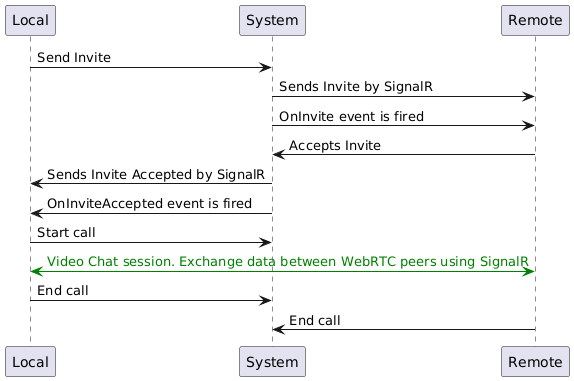

# .NET WebRTC

A .NET library for WebRTC, enabling real-time communication in your web applications.

## Features

- Peer-to-peer audio and video communication
- Data channels for real-time data transfer
- High-level API for simplified WebRTC operations
- Client available for Blazor, Angular, React
- Easy integration with ASP.NET Core web applications
- Cross-platform support (Windows, macOS, Linux) for Server

## Server

You can use any ASP.NET Core web application to host the Server.

You can even use just a Console app as a Server.

Just create one with Web Sdk (project file):

```
<Project Sdk="Microsoft.NET.Sdk.Web">
```

I have used a Web API (SampleApi).

```csharp
builder.Services.AddSignalR();

builder.Services.AddCors(options =>
{
    options.AddPolicy("MyPolicy", builder => builder.AllowAnyHeader().AllowAnyMethod().AllowCredentials().SetIsOriginAllowed(origin => true)
                                                    .WithOrigins("https://localhost:7086/"));
});
```

```csharp
app.UseCors("MyPolicy");
.
.
app.MapHub<VideoChatHub>("/chathub");
```

## Blazor Client

You can go through my SampleBlazorWebApp to see how to use the Client.

[**Browse client library**](https://github.com/VeritasSoftware/WebRTC/tree/master/WebRTC.Blazor.Client)

## Angular Client

You can go through sample-angular-web-app to see how to use the Client.

[**Browse client library**](https://github.com/VeritasSoftware/WebRTC/tree/master/sample-angular-web-app/projects/ts-webrtc-angular-client/src/lib)

## React Client

You can go through sample-react-web-app to see how to use the Client.

[**Browse client library**](https://github.com/VeritasSoftware/WebRTC/tree/master/ts-webrtc-react-client/src)

## Steps to run the demo

Run the SampleApi first, then run the SampleBlazorWebApp or sample-angular-web-app or sample-react-web-app.

Open multiple browsers (eg. Edge & Chrome), each with their own camera & microphone, to see the WebRTC communication in action. 

On the video chat page, select "Local" in the dropdown in one browser first.

Then, "Remote" in the other browser to see the communication.

Make sure to allow camera & microphone access when prompted by the browser.

In the Local browser, click "Invite" to invite the Remote browser.

Then, the Remote browser, automatically accepts the Invite in the demo but you can defer it too.

In the Local browser, "Invite accepted." is shown.

Then, in the Local browser, click "Start Call" to start the WebRTC communication.

When done, click "End Call" in either browser to end the call.

## WebRTC communication supported by the system

